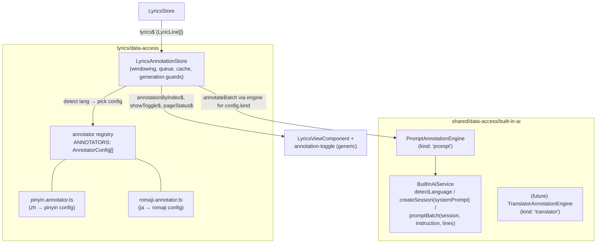

# Lyrics Annotation — Scalable Language-Pair Architecture + Kanji→Romaji

**Date:** 2026-07-13
**Status:** Approved design
**Predecessor:** `2026-06-21-pinyin-lyrics-design.md` (Chinese→pinyin, shipped in PR #119/#120)

## Goal

Generalize the pinyin-lyrics feature into a **lyrics annotation** architecture where
each language pair is a declarative config, and ship **Japanese kanji/kana→romaji**
as the second concrete pair. Adding a future transliteration pair should cost one
config file plus one registry line. The design also reserves a clean seam for
**translation pairs** (e.g. Vietnamese→English, Tagalog→English) via Chrome's
Translator API, without building them now.

## Background

The shipped `PinyinStore` machinery — focus-sorted queue, batch windows,
generation guards, session lifecycle, paused-song seeding — is language-agnostic.
Only three things are Chinese-specific:

1. the language gate (`lang.startsWith('zh')`),
2. the line filter (`containsHan`),
3. the prompts (system prompt + batch instruction).

Two categories of language pair exist:

- **Transliteration** (zh→pinyin, ja→romaji): a reading aid rendered above the
  original line, produced by the **Prompt API** (Gemini Nano).
- **Translation** (vi→en, tl→en): a meaning conversion, best served by Chrome's
  dedicated **Translator API** (purpose-built model, per-pair downloads, no
  prompt parsing). *Designed for, not built, in this iteration.*

## Decisions

- **Scope:** Refactor to the generic architecture + ship romaji now. Translation
  pairs are a designed-for seam only.
- **Japanese output:** Full-line Hepburn romaji — kanji, hiragana, and katakana
  all romanized (e.g. 君の名前 → *kimi no namae*), macrons for long vowels
  (ō, ū). Kana-only lines are annotated too.
- **UX model:** One annotator per song, auto-picked by detected language. One
  toggle in the now-playing bar whose icon/tooltip comes from the active
  annotator's config.
- **Baseline:** Pre-existing uncommitted pinyin experiments stashed; work starts
  from clean `main` (c14beec).

## Architecture



**Principle: the store owns orchestration, configs own knowledge.** The store's
machinery moves over unchanged; it reads prompts/filters/labels from the active
config instead of constants.

### File moves and renames (within existing Nx libs — no new projects)

| Today | Becomes |
|---|---|
| `pinyin.store.ts` | `lyrics-annotation.store.ts` (`LyricsAnnotationStore`) |
| `pinyin.models.ts` | `annotation.models.ts` (`AnnotationState`, `AnnotationLineState`, `AnnotatorConfig`) |
| — | `annotators/pinyin.annotator.ts`, `annotators/romaji.annotator.ts`, `annotators/index.ts` (registry) |
| `han-util.ts` | `script-util.ts` (`containsHan` + new `containsJapanese`) |
| `pinyin-toggle` lib | lib stays; component renders icon/tooltips from the active config |
| `createPinyinSession` / `promptPinyinBatch` | `createSession(systemPrompt, opts)` / `promptBatch(session, instruction, lines, signal)` |

### The `AnnotatorConfig` contract

```ts
export interface AnnotatorConfig {
  id: string;                              // 'pinyin' | 'romaji' | …
  kind: 'prompt';                          // union grows to | 'translator' later
  matchesLanguage(lang: string): boolean;  // BCP-47 from LanguageDetector, e.g. 'zh-Hant', 'ja'
  lineQualifies(text: string): boolean;    // which lines get annotated
  expectedLanguages: string[];             // passed to LanguageModel.availability()
  systemPrompt: string;
  batchInstruction: string;                // per-batch instruction preceding the lines
  toggle: {
    icon: string;                          // 拼 / あ
    tooltipShow: string;
    tooltipHide: string;
    preparingLabel: string;                // "Preparing pinyin…" / "Preparing romaji…"
  };
}
```

- **Registry order matters and is documented:** first `matchesLanguage` match
  wins. Current matchers (`zh*`, `ja*`) are disjoint; the rule exists so future
  overlapping matchers (e.g. a generic fallback) are deterministic.
- **Engine seam:** the store dispatches `annotateBatch` through a small
  `AnnotationEngine` interface keyed by `config.kind`. Only the `'prompt'`
  engine is implemented now; `'translator'` slots in later without touching the
  store.

### The pinyin config (pure extraction)

Current system prompt, batch instruction, `containsHan`,
`lang.startsWith('zh')`, `expectedLanguages: ['zh','en']`, 拼 icon. **Zero
behavior change for Chinese songs.**

### The romaji config (new)

- `matchesLanguage`: `lang.startsWith('ja')`
- `lineQualifies`: `containsJapanese` — true if the line contains any kana
  (U+3040–U+30FF) **or** Han character. Kanji are Han-block codepoints, so
  kanji-only lines qualify; pure-Latin/instrumental lines (♪, "Instrumental")
  are skipped. Song-level detection already decided ja vs zh, so `containsHan`
  overlap between configs is harmless.
- `systemPrompt`: precise Japanese→Hepburn-romaji transliterator; romanize
  kanji, hiragana, and katakana; macrons for long vowels; do not translate
  meaning.
- `batchInstruction`: same JSON-array-of-strings shape as pinyin, so
  `parseArray` and the length-mismatch guard are shared as-is.
- `expectedLanguages`: `['ja', 'en']`.
- `toggle`: icon あ, "Show/Hide romaji", "Preparing romaji…".

### Flow changes

- **Availability check moves after detection:** today the flow checks
  `availability({languages: ['zh','en']})` before detecting. New order:
  **detect → pick annotator from registry → check availability with that
  config's `expectedLanguages`**. A Chrome build could support `zh` but not
  `ja`; unsupported is silent, per pair.
- **State shape:** `activeAnnotatorId: string | null` replaces
  `isChinese: boolean`; `annotationByIndex` replaces `pinyinByIndex`. All other
  state fields carry over.
- **Session lifecycle unchanged:** one shared Prompt API session per song,
  created with the active annotator's system prompt; `reset()` on track change
  destroys it. Holds because a song has exactly one active annotator.
- **No matching annotator** for the detected language → `activeAnnotatorId:
  null`, feature silently off (replaces today's `isChinese: false` path).

## UX

- **Toggle:** now-playing-bar toggle renders the active config's icon (拼 / あ)
  and tooltips. Same visibility rule: appears only once at least one line is
  `done`.
- **Page status:** `pinyinPageStatus$` → `annotationPageStatus$`, same
  `'downloading' | 'preparing' | null` states and bottom-right pill. The
  "preparing" text comes from `toggle.preparingLabel` per config.
- **Enabled flag stays session-global** (one flag, not per-annotator) —
  matches the one-annotator-per-song model.

## Error handling (inherited unchanged)

- Per-batch `error` status on parse/length-mismatch failure; other batches
  continue.
- Generation guards on every await boundary (track switch mid-download,
  mid-detect, mid-batch).
- Missing `LanguageModel`/`LanguageDetector` globals → `support: 'unsupported'`
  → silent.
- New: detected language with no matching annotator → silently off.

## Testing

- Existing 26 store specs migrate to `LyricsAnnotationStore` with the pinyin
  config — they are the regression suite proving the refactor changed nothing.
- New specs: romaji config selection on `ja` detection; `containsJapanese`
  units (kana-only, kanji-only, Latin, ♪ lines); per-annotator availability
  gating; no-matching-annotator path.
- `BuiltInAiService` specs update for the generic `createSession`/`promptBatch`
  signatures.
- Live verification (per CLAUDE.md): real Chrome via Playwriter at
  `http://127.0.0.1:4200/` — one Mandopop track (pinyin regression) + one J-pop
  track (romaji). Requires a Chrome build with built-in AI enabled.

## Out of scope (designed-for, not built)

- `kind: 'translator'` engine and Translator API wrappers.
- vi→en / tl→en configs.
- Stacked annotations (multiple simultaneous annotators per song).
- Per-annotator user preferences.
