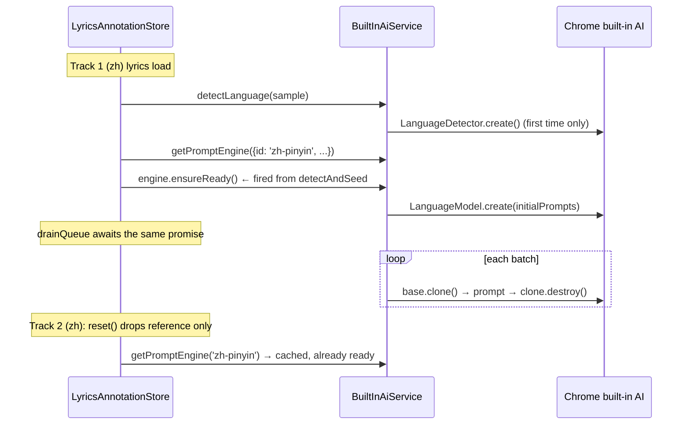

# Built-in AI session warm-up and hygiene

**Date:** 2026-07-29
**Scope:** `libs/web/shared/data-access/built-in-ai`, `libs/web/lyrics/data-access`
**Motivation:** Chrome's [built-in AI dos and don'ts](https://developer.chrome.com/docs/ai/built-in-ai-dos-donts) — create sessions when user intent is clear, reuse base sessions via `clone()`, don't recreate what you can cache.

## Problem

Every track rebuilds the whole AI stack from scratch:

- `detectLanguage()` calls `LanguageDetector.create()` per track.
- The Prompt API session is created inside the first `drainQueue()` pass, after the user is already waiting on annotations.
- Every batch prompt lands in the same session, so later batches in a long song carry all earlier lyrics as context. That grows latency and creeps toward the session quota.
- `reset()` destroys the session on track change, so song 2 of a Chinese playlist pays the full session-creation cost again.

We deliberately do NOT create a session at app start: the system prompt depends on the detected annotator (zh vs ja), and `LanguageModel.create()` can trigger a multi-GB model download. Intent is clear at `detectAndSeed()`, not at boot.

## Design

### Service (`built-in-ai.service.ts`)

1. **Detector reuse.** Cache the `LanguageDetector.create()` promise on first use; every `detectLanguage()` call reuses it. A failed creation clears the cache so the next call retries.

2. **Engine cache.** `createPromptEngine(spec)` becomes `getPromptEngine(spec)`, backed by `Map<string, AnnotationEngine>` keyed by a new `PromptEngineSpec.id` (the annotator id). Same annotator returns the same engine, whose base session survives for the app's lifetime. Two annotators exist today, so the cache tops out at two sessions. Sessions are context state, not model copies, so this is cheap.

3. **Concurrent-safe `ensureReady`.** The engine memoizes the in-flight creation promise. The warm-up call and `drainQueue` share one creation instead of racing to create two sessions. A failed creation clears the memo so a later call retries.

4. **Clone per batch.** `annotateBatch` calls `session.clone()`, prompts the clone, destroys it in a `finally`. The base session keeps only the system prompt. `AnnotationSession` gains `clone(opts?: { signal?: AbortSignal }): Promise<AnnotationSession>` in both the interface and the ambient `LanguageModel` typings.

### Store (`lyrics-annotation.store.ts`)

5. **Warm at intent.** `detectAndSeed()` fires `engine.ensureReady()` (with the existing download-progress state patches) as soon as the annotator is matched and availability confirmed. `drainQueue` awaits the same memoized promise, so whoever runs second waits on the first's work.

6. **`reset()` stops destroying.** Track change nulls the store's engine reference; the base session stays in the service cache. The stale-generation guard in `drainQueue` no longer destroys the engine — each cached engine is permanently bound to one annotator's system prompt, so adopting a wrong-language session is structurally impossible. The guard still prevents stale state writes.

### Session lifecycle

## Error handling

Clone or prompt failures flow into the existing per-batch `error` status. Failed session creation clears the memoized promise; the next drain retries. No new error surfaces.

## Testing

- `built-in-ai.service.spec.ts`: detector created once across calls; `getPromptEngine` returns the same instance per id; concurrent `ensureReady` calls create one session; `annotateBatch` prompts a clone and destroys it; base session untouched by batch failures.
- `lyrics-annotation.store.spec.ts`: `ensureReady` fires from `detectAndSeed` before any drain; `reset()` leaves the base session alive; stale-generation path no longer destroys the engine.
- Real browser via Playwriter on `http://127.0.0.1:4200` with one zh and one ja track; confirm warm second-song start in console timings (`[BuiltInAI] createSession` absent on song 2).
